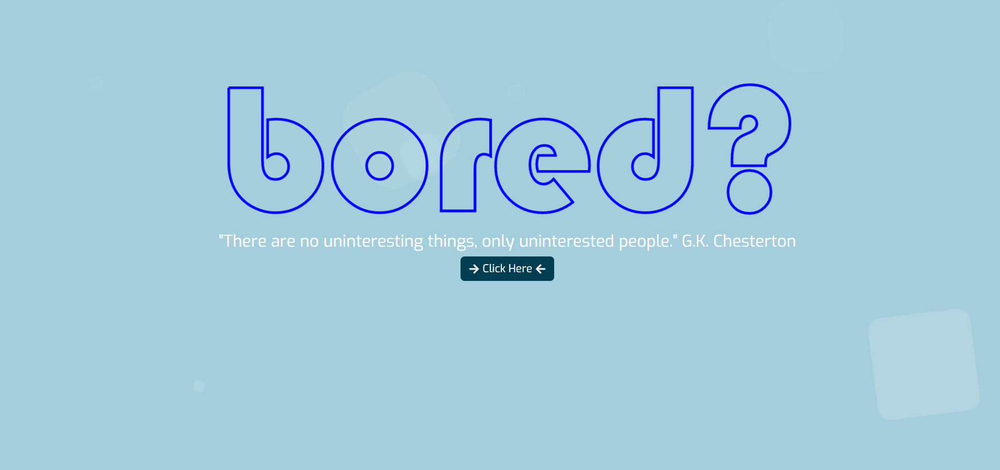

# Bored?

## Features

### This application has the following features:

- A user can generate activities with data from boredapi.
- The application displays 9 different activities with an image and a short description of each activity.
- There is the option for the user to explore further by watching a YouTube video linked to the activity or search for more information on Google.

## User Story
As a mobile device user, I would like an application that allows me to search for activities to do so that I can use my time wisely instead of wasting it on social media.  When I click search, I am presented with 9 different activities that change each time and are presented in a clear, easy to read format. I can explore further options on YouTube and Google.

## Installation
# Getting Started with Create React App

This project was bootstrapped with [Create React App](https://github.com/facebook/create-react-app).

## Available Scripts

In the project directory, you can run:

### `npm start`

Runs the app in the development mode.\
Open [http://localhost:3000](http://localhost:3000) to view it in your browser.

The page will reload when you make changes.\
You may also see any lint errors in the console.

### `npm test`

Launches the test runner in the interactive watch mode.\
See the section about [running tests](https://facebook.github.io/create-react-app/docs/running-tests) for more information.

### `npm run build`

Builds the app for production to the `build` folder.\
It correctly bundles React in production mode and optimizes the build for the best performance.

The build is minified and the filenames include the hashes.\
Your app is ready to be deployed!

See the section about [deployment](https://facebook.github.io/create-react-app/docs/deployment) for more information.

### `npm run eject`

**Note: this is a one-way operation. Once you `eject`, you can't go back!**

If you aren't satisfied with the build tool and configuration choices, you can `eject` at any time. This command will remove the single build dependency from your project.

Instead, it will copy all the configuration files and the transitive dependencies (webpack, Babel, ESLint, etc) right into your project so you have full control over them. All of the commands except `eject` will still work, but they will point to the copied scripts so you can tweak them. At this point you're on your own.

You don't have to ever use `eject`. The curated feature set is suitable for small and middle deployments, and you shouldn't feel obligated to use this feature. However we understand that this tool wouldn't be useful if you couldn't customize it when you are ready for it.## Learn More

You can learn more in the [Create React App documentation](https://facebook.github.io/create-react-app/docs/getting-started).

To learn React, check out the [React documentation](https://reactjs.org/).

## Usage
Deployed Page: https://boredappproj.netlify.app/

## Technologies Used
- Postman: https://web.postman.co/
- Figma: https://www.figma.com/
- VS Code: https://code.visualstudio.com/
- React.js: https://react.dev/ 
- Bootstrap: https://react-bootstrap.github.io/ & https://getbootstrap.com/
- CSS

## APIs used
- YouTube API: https://developers.google.com/youtube/v3
- Bored API: https://www.boredapi.com/

## NPM Modules used
- React SVG Drawing: https://www.npmjs.com/package/react-svg-drawing
- React Icons: https://www.npmjs.com/package/react-icons
- Animejs: https://www.npmjs.com/package/animejs

## Credits
The following websites were used to support this project:
- https://www.youtube.com/watch?v=mAKYW_1f-dw
- https://blog.logrocket.com/exploring-anime-js-example-site-animation-project/
- https://animejs.com/documentation/#lineDrawing
- https://css-tricks.com/scale-svg/
- https://www.youtube.com/watch?v=3RvQJX1_fKQ&t=618s

## Colloborators
- Rita Fitchett https://github.com/reets93
- Kamel Beloula https://github.com/kamel-beloula
- Lidia Bhogal https://github.com/LidiaBhogal
- Lissa Simpson https://github.com/lissasimp

## Project Presentation
https://docs.google.com/presentation/d/1i6_o-dKMwr9Z_J4mNsmY9knlEVSNyBfS3uqAzZnFHhw/edit?usp=sharing 

## Permission
I'm happy for you to use the code or parts of the code for your own site, it is open source so people can learn from it and adapt it. However, I would encourage you to modify the theme and components to make it your own. If you are using the site's design largely unmodified, I'd appreciate all collaborators (listed above) being credited as the designers of the website.

I do not give permission to present any of my projects as your own.

## License

Permission is hereby granted, free of charge, to any person obtaining a copy of this software and associated documentation files (the "Software"), to deal in the Software without restriction, including without limitation the rights to use, copy, modify, merge, publish, distribute, sublicense, and/or sell copies of the Software, and to permit persons to whom the Software is furnished to do so, subject to the following conditions:

The above copyright notice and this permission notice shall be included in all copies or substantial portions of the Software.

THE SOFTWARE IS PROVIDED “AS IS”, WITHOUT WARRANTY OF ANY KIND, EXPRESS OR IMPLIED, INCLUDING BUT NOT LIMITED TO THE WARRANTIES OF MERCHANTABILITY, FITNESS FOR A PARTICULAR PURPOSE AND NONINFRINGEMENT. IN NO EVENT SHALL THE AUTHORS OR COPYRIGHT HOLDERS BE LIABLE FOR ANY CLAIM, DAMAGES OR OTHER LIABILITY, WHETHER IN AN ACTION OF CONTRACT, TORT OR OTHERWISE, ARISING FROM, OUT OF OR IN CONNECTION WITH THE SOFTWARE OR THE USE OR OTHER DEALINGS IN THE SOFTWARE.

